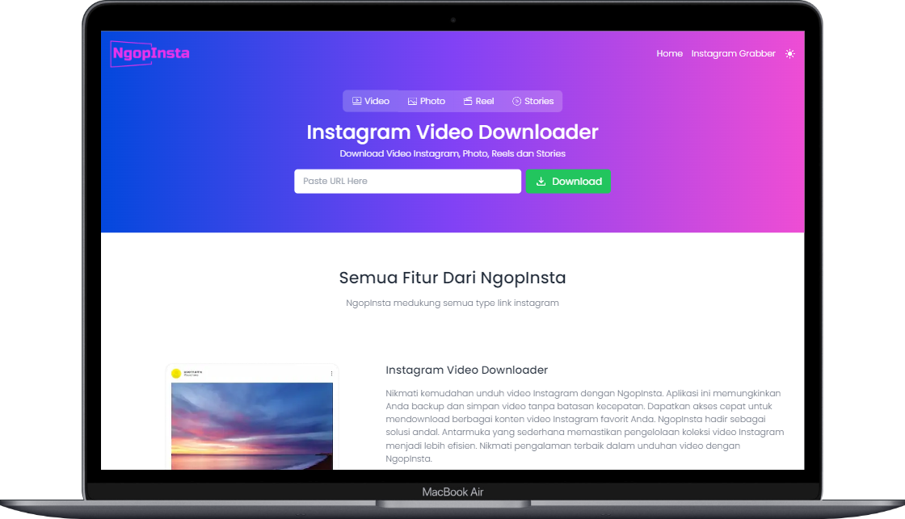

# NgopInsta



NgopInsta adalah situs yang memungkinkan pengguna untuk dengan mudah mengunduh video dari platform media sosial Instagram. Proyek ini dikembangkan menggunakan framework Next.js.

## Preview

Kunjungi situs [NgopInsta](https://ngopinsta.vercel.app/) untuk melihat tampilan website nya.

## Fitur Utama

- **Instagram Video Download:** Unduh video dari Instagram.
- **Instagram Photo Download:** Unduh photo dari Instagram.
- **Instagram Reels Download:** Unduh reels dari Instagram.
- **Instagram Stories Download:** Unduh stories dari Instagram.

## Penggunaan

1. **Clone Repositori:**

   ```bash
   git clone https://github.com/SukunDev/ngopinsta.git
   cd ngopinsta
   ```

2. **Instal Dependencies:**

   ```bash
   npm install
   ```

3. **Jalankan Aplikasi:**

   ```bash
   npm run dev
   ```

4. **Buka Browser:**
   Buka [http://localhost:3000](http://localhost:3000) untuk melihat aplikasi di browser.

## Kontribusi

Jika Anda ingin berkontribusi pada proyek ini, kami sangat menghargai setiap bentuk dukungan. Silakan buka [Panduan Kontribusi](CONTRIBUTING.md) untuk informasi lebih lanjut.

## Lisensi

Proyek ini dilisensikan di bawah [MIT License](LICENSE).

---

Dikembangkan oleh [SukunDev](https://github.com/SukunDev)
